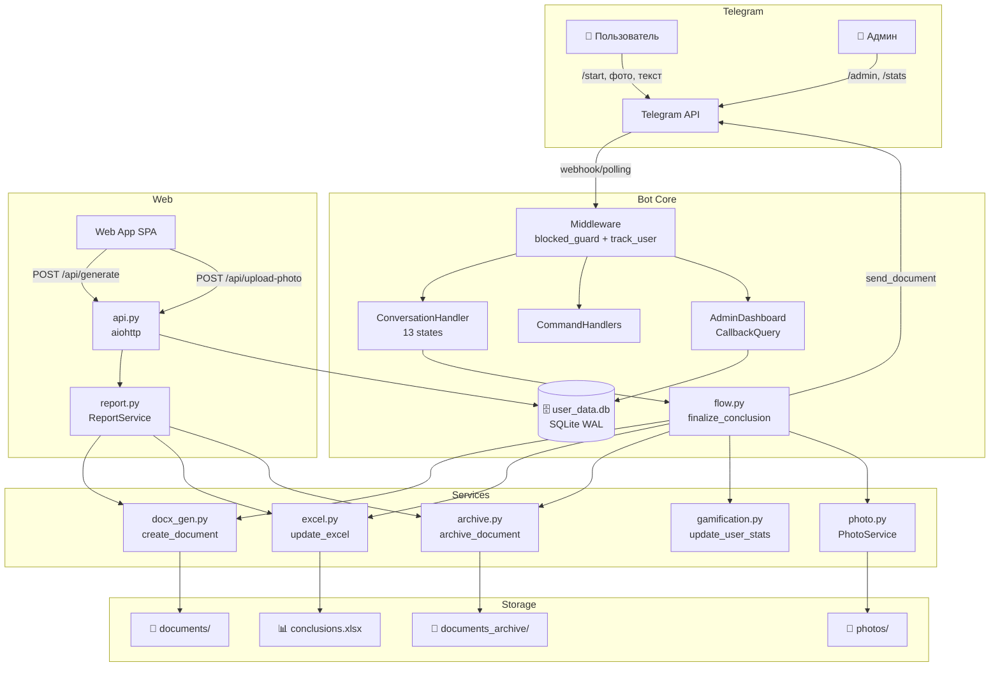

# 🏗️ ARCHITECTURE.md — BestBOT SmartQA

> Spec-First документация. Любое изменение кода начинается здесь.

## 1. Миссия проекта

Telegram-бот для создания **заключений по антиквариату**. Эксперты через чат-бот или Web App заполняют форму (подразделение, номер заключения, билет, дата, регион, фото предметов + описание + оценка), бот генерирует DOCX-документ, отправляет в региональный топик группы и ведёт Excel-базу.

---

## 2. Стек технологий

| Слой | Технология | Версия |
|---|---|---|
| Язык | Python | 3.11+ |
| Telegram SDK | python-telegram-bot | latest (PTB v20+) |
| HTTP-сервер (API) | aiohttp | latest |
| HTTP-клиент | httpx | latest |
| БД | SQLite через aiosqlite | WAL mode |
| Документы | python-docx | latest |
| Excel | openpyxl | latest |
| Изображения | Pillow | latest |
| Конфигурация | python-dotenv | latest |

---

## 3. Структура каталогов

```
BestBOT_SmartQA_Ready/
├── run_modern_bot.py          # Точка входа: venv-детект, lockfile, автоперезапуск
├── .env                       # Секреты (BOT_TOKEN, ADMIN_IDS и т.д.)
├── requirements.txt           # Python-зависимости
├── template.docx              # Шаблон DOCX-заключения
├── conclusions.xlsx           # Excel-база заключений
├── user_data.db               # SQLite база (WAL)
│
├── modern_bot/                # ═══ ОСНОВНОЙ ПАКЕТ ═══
│   ├── main.py                # Сборка Application: handlers, jobs, middleware
│   ├── config.py              # Все настройки и константы
│   ├── api.py                 # aiohttp REST API (20+ endpoints)
│   ├── version.py             # __version__
│   │
│   ├── handlers/              # ═══ ОБРАБОТЧИКИ КОМАНД ═══
│   │   ├── conversation.py    # 13-state ConversationHandler (основной флоу)
│   │   ├── commands.py        # /start, /menu
│   │   ├── help.py            # /help
│   │   ├── admin.py           # Загрузка admin_ids, /add_admin, /broadcast
│   │   ├── admin_dashboard.py # /admin — интерактивная панель (CallbackQuery)
│   │   ├── admin_interactive.py  # Reply-based редактирование данных
│   │   ├── admin_reconciliation.py # Сверка Excel
│   │   ├── admin_search.py    # Поиск по номеру билета
│   │   ├── reports.py         # /history, /stats, /download_month
│   │   ├── user_commands.py   # /add_user, /remove_user, /remove_admin
│   │   ├── user_management.py # add_user() — автотрекинг
│   │   ├── common.py          # safe_reply, stream_safe_reply, network recovery
│   │   ├── menu_helper.py     # Кнопочное меню
│   │   ├── backup_restore.py  # Бэкап/восстановление БД
│   │   ├── db_upload.py       # Загрузка .db через чат
│   │   └── dump.py            # Дамп данных
│   │
│   ├── services/              # ═══ БИЗНЕС-ЛОГИКА ═══
│   │   ├── flow.py            # finalize_conclusion() — главный пайплайн
│   │   ├── report.py          # ReportService — для API-запросов
│   │   ├── docx_gen.py        # Генерация DOCX из шаблона
│   │   ├── excel.py           # Обновление Excel-базы
│   │   ├── archive.py         # Архивация документов по месяцам
│   │   ├── photo.py           # PhotoService — скачивание/хранение фото
│   │   ├── gamification.py    # Очки, ранги, достижения, лидерборд
│   │   ├── analytics.py       # Аналитика использования
│   │   ├── retention.py       # Очистка старых данных
│   │   └── draft_helper.py    # Стриминг-уведомления (edit_message)
│   │
│   ├── database/
│   │   └── db.py              # Единственный модуль БД (aiosqlite)
│   │
│   ├── utils/
│   │   ├── logger.py          # setup_logger()
│   │   ├── files.py           # Файловые утилиты, бэкап, сжатие
│   │   ├── validators.py      # is_digit, is_valid_ticket_number
│   │   ├── formatters.py      # Форматирование строк
│   │   ├── date_helper.py     # Работа с датами
│   │   └── tunnel.py          # pyngrok туннель
│   │
│   └── web_app/               # ═══ WEB-ИНТЕРФЕЙС ═══
│       ├── index.html          # SPA — форма создания заключений
│       ├── app.js              # Клиентская логика (75 KB)
│       ├── styles.css          # Стили (38 KB)
│       ├── ux-improvements.js  # UX-улучшения
│       ├── super_admin.html    # Панель суперадмина
│       ├── quiz_questions.json # Квиз по антиквариату
│       └── service-worker.js   # Офлайн-кеш
│
├── config/
│   └── admins.json            # Список администраторов
│
├── tests/
│   └── test_api_smoke.py      # Smoke-тесты API (7 тестов)
│
└── .agents/                   # ═══ ПРАВИЛА ДЛЯ AI-АГЕНТОВ ═══
    ├── rules.md               # Правила разработки
    └── workflows/             # Воркфлоу (пошаговые инструкции)
```

---

## 4. Архитектура (Data Flow)



---

## 5. База данных (6 таблиц)

| Таблица | Назначение | Ключ |
|---|---|---|
| `user_data` | Черновики пользователей (текущая сессия) | `user_id` PK |
| `users` | Профили пользователей + блокировка | `user_id` PK |
| `processed_tickets` | Защита от дубликатов (Smart Guard) | `ticket_number` PK |
| `user_stats` | Геймификация: очки, ранги, достижения | `user_id` PK |
| `quiz_attempts` | Статистика квизов | `id` AUTO |
| `settings` | Глобальные настройки (тема, кеш-версия) | `key` PK |

---

## 6. API Endpoints

### Публичные
| Метод | Путь | Описание |
|---|---|---|
| GET | `/` | Web App (index.html с инъекцией конфига) |
| GET | `/health` или `/api/health` | Health check |
| POST | `/api/generate` | Создание заключения (DOCX) |
| POST | `/api/upload-photo` | Загрузка фото (multipart) |
| POST | `/api/quiz/submit` | Результат квиза |
| OPTIONS | `*` | CORS preflight |

### Суперадмин (`/api/super-admin/*`)
| Метод | Путь | Описание |
|---|---|---|
| GET | `/super-admin` | Панель суперадмина (HTML) |
| GET | `/stats` | Статистика |
| GET | `/health` | Здоровье системы |
| GET | `/users` | Список пользователей + статистика |
| GET | `/users-list` | Список без статистики |
| POST | `/update-user` | Обновить ранг/очки |
| POST | `/user-block` | Блокировать/разблокировать |
| POST | `/add-user` | Добавить пользователя |
| POST | `/remove-user` | Удалить пользователя |
| POST | `/broadcast` | Рассылка |
| GET | `/regions` | Список регионов |
| GET | `/logs` | Последние 100 строк логов |
| GET | `/stream` | SSE (live-обновления) |
| POST | `/clear-cache` | Сброс кеша |

---

## 7. Основной пайплайн (Conclusion Flow)

```
1. Пользователь вводит данные (Chat или WebApp)
   ├── department_number, issue_number, ticket_number
   ├── date (DD.MM.YYYY, не будущая)
   ├── region (из REGION_TOPICS)
   └── items[] (photo + description + evaluation)

2. finalize_conclusion() [services/flow.py]
   ├── create_document() → DOCX из template.docx
   ├── send_document → пользователю
   ├── send_document → в группу (топик региона)
   ├── update_excel() → conclusions.xlsx
   ├── archive_document() → documents_archive/
   ├── register_processed_ticket() → Smart Guard
   └── update_user_stats() → геймификация
```

---

## 8. Конфигурация (.env)

| Переменная | Обязательно | Описание |
|---|---|---|
| `BOT_TOKEN` | ✅ | Токен Telegram бота |
| `MAIN_GROUP_CHAT_ID` | ✅ | ID группы для заключений |
| `SUPER_ADMIN_ID` | ✅ | ID супер-администратора |
| `DEFAULT_ADMIN_IDS` | ✅ | Список админов через запятую |
| `IMAGEBAN_CLIENT_ID` | — | Ключ ImgBB (устаревший, есть local mode) |
| `DATA_RETENTION_DAYS` | — | Дней хранения данных (90) |
| `API_ENABLED` | — | Включить REST API (true) |
| `API_PORT` | — | Порт API (8080) |
| `API_BIND_HOST` | — | Хост привязки (0.0.0.0) |
| `API_AUTH_TOKEN` | — | Токен для защиты API |
| `PHOTO_STORE_MODE` | — | `local` или `telegram` |

---

## 9. Инварианты (нарушение = баг)

1. **Дата не в будущем** — проверяется в 3 местах: conversation.py, api.py, web_app
2. **Номер билета = 11 цифр** — `MIN_TICKET_DIGITS == MAX_TICKET_DIGITS == 11`
3. **MAX_PHOTOS = 30** — лимит предметов в одном заключении
4. **Один экземпляр бота** — lockfile (.bot.lock + глобальный по токену)
5. **Админ-защита** — SUPER_ADMIN_ID не может быть заблокирован/удалён
6. **Транзакционность БД** — все записи через `db_lock` + `db.commit()`
7. **CORS** — только ALLOWED_ORIGINS (по умолчанию GitHub Pages)
8. **Temp-файлы** — удаляются после генерации документа

---

## 10. Регионы и топики

```python
REGION_TOPICS = {
    "Санкт-Петербург": 11, "Свердловская область": 8,
    "Челябинская область": 6, "Екатеринбург": 4,
    "Башкирия": 12, "Тюмень": 13, "ХМАО-Югра": 15,
    "Нижний Новгород": 9, "Ростовская область": 17,
    "Челябинск": 2, "Магнитогорск": 7, "Курган": 16,
    "Краснодарский край": 14,
}
```

Каждый регион → отдельный `message_thread_id` в основной группе.

---

## 11. Геймификация

**Ранги** (по очкам):
| Очки | Ранг |
|---|---|
| 0–49 | 🥉 Новичок |
| 50–149 | 🥈 Ученик |
| 150–399 | 🥇 Стажер |
| 400–999 | 🎖 Специалист |
| 1000–2499 | 🏆 Мастер |
| 2500–4999 | 🚀 Профи |
| 5000–9999 | 💎 Эксперт |
| 10000+ | 👑 Легенда |

**Формула очков:** `10 + (стоимость_предмета // 1000)` за каждый билет.

---

## 12. Запуск приложения

```
run_modern_bot.py
  ├── Detect/switch to venv
  ├── check_lockfile() — prevent duplicates
  └── while True:  (auto-restart loop)
        ├── main() [modern_bot/main.py]
        │   ├── Build Application (PTB)
        │   ├── post_init() → init_db() + start_api_server()
        │   ├── Register all handlers
        │   ├── Register jobs (cleanup, backup, leaderboard)
        │   └── run_polling()
        └── on crash: sleep(5) → restart
```
