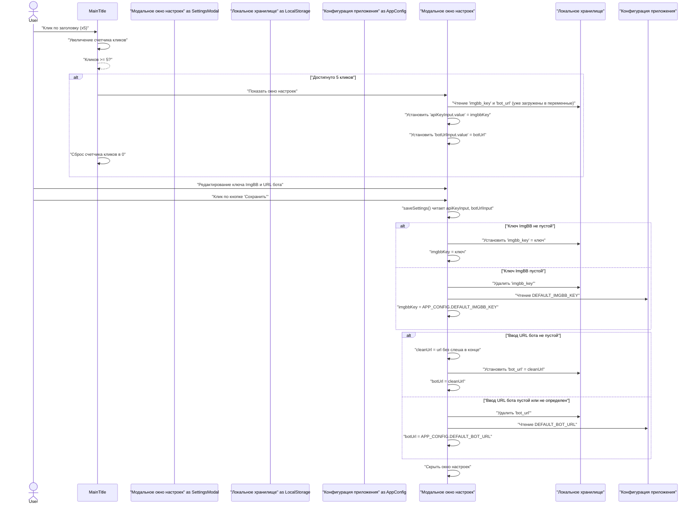
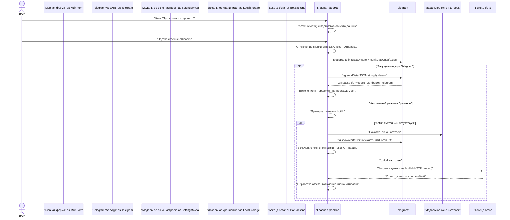
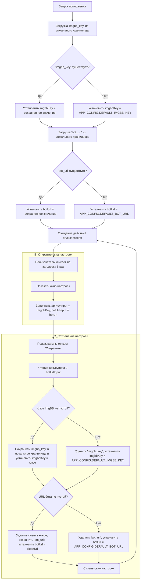

# Modern Bot

Это улучшенная и переработанная версия бота для создания заключений, включающая режим веб-приложения (Mini App).

## Возможности
- **Модульная структура**: Чистый код, организованный в папке `modern_bot/`.
- **Веб-приложение**: Удобный ввод данных через Telegram Mini App с защитой от ошибок.
- **Автономный режим**: Возможность использовать веб-приложение в любом браузере (Chrome, Safari) для генерации документов без Telegram.
- **Рассылка**: Отправка сообщений всем пользователям через админ-панель.
- **Улучшенные отчеты**: Усовершенствованная работа с архивами и статистикой.

### Production-Ready Features
- **Логирование**: Автоматическая запись логов в `logs/bot_YYYY-MM-DD.log` с ежедневной ротацией (хранение 7 дней).
- **Автобэкапы**: Ежедневное копирование БД и persistence в `backups/` (хранение **90 дней**).
- **Восстановление из бэкапа**: Админы могут выбрать и восстановить любую предыдущую копию БД через админ-панель.
- **Persistence**: Сохранение состояний диалогов на диск — бот не теряет данные при перезапуске.
- **Архивная ретенция**: Автоматическое удаление заключений старше 90 дней.
- **Healthcheck API**: Эндпоинт `GET /health` для мониторинга статуса бота.
- **Системный мониторинг**: Кнопка "🖥️ Система" в админке для проверки диска, БД, архива.

### Административные возможности
- **Интерактивная админ-панель**: Управление через кнопки (`/admin`), команды не нужны.
- **Сверка билетов**: Загрузка Excel/TXT файла для поиска пропущенных заключений.
- **Супер-Админ защита**: ID 2064900 защищен от случайного удаления.
- **Аналитика и статистика**: Детальные отчеты по регионам, датам, подразделениям.
- **Поиск по билету**: Быстрый поиск заключения по номеру.

### Безопасность и валидация
- **Защита от некорректных данных**:
  - Валидация ID админов/пользователей (только положительные числа)
  - Проверка формата даты и блокировка будущих дат
  - Лимит на количество фотографий (10 шт.)
  - Проверка размера и формата загружаемых файлов
- **Защита файлов БД**:
  - Проверка SQLite magic bytes при загрузке и восстановлении
  - Автоматическая страховочная копия перед восстановлением
- **Лимиты на операции**:
  - Рассылка: макс. 4000 символов
  - Сверка: макс. 10 МБ
  - Загрузка БД: макс. 50 МБ

## Как запустить
1.  Убедитесь, что вы находитесь в корне проекта (`/Users/oleg/Project_SKLAD`).
2.  Запустите бота:
    ```bash
    python3 run_modern_bot.py
    ```
3.  **Для автономного режима**: Запустите туннель ngrok:
    ```bash
    ./start_tunnel.sh
    ```
    *Примечание: URL по умолчанию в `index.html` настроен на конкретный адрес ngrok. Если ваш URL туннеля изменится, вам нужно будет обновить его в настройках веб-приложения.*

## Настройка веб-приложения
Чтобы использовать веб-приложение:
1.  Актуальная версия мини-приложения лежит в корне репозитория (`web_app/index.html`). Копия в `modern_bot/web_app/` синхронизируется автоматически и используется как запасная.
2.  Разместите файл `web_app/index.html` на публичном сервере (например, GitHub Pages).
3.  **Автономный доступ**: Откройте URL GitHub Pages прямо в браузере.
    - Если "URL бота" не настроен или неверен, приложение предложит вам ввести его (например, ваш URL ngrok).
    - **Секретные настройки**: Нажмите на заголовок "Новое заключение" 5 раз подряд, чтобы открыть настройки вручную.

## Управление ботом
### Для администраторов
Основное управление осуществляется через **интерактивную админ-панель** (`/admin`):
- 📊 **Статистика** — общие показатели
- 📈 **Аналитика** — детальные отчеты по регионам/датам
- 🔎 **Поиск** — найти заключение по номеру билета
- 📦 **Архив** — выгрузка документов за месяц
- 👥 **Пользователи** — управление доступом
- ⚙️ **Администраторы** — добавление/удаление админов
- 📢 **Рассылка** — сообщение всем пользователям
- 🔍 **Сверка билетов** — поиск пропущенных заключений
- 🖥️ **Система** — статус сервера, скачивание/восстановление БД

### Команды (опционально)
Некоторые действия доступны и через команды:
- `/admin` — открыть админ-панель
- `/add_admin <ID>` — добавить администратора
- `/remove_admin <ID>` — удалить администратора (кроме Супер-Админа)
- `/broadcast <Сообщение>` — отправить рассылку
- `/stats` — показать статистику
- `/help` — справка по боту

## Архитектура и потоки данных

### Поток настроек и конфигурации


## Распределение лотов аукциона
- Скрипт: `modern_bot/scripts/allocate_auction.py`
- По умолчанию использует файлы из корня репозитория:
  - `Табличная_часть_Продажи_распродажа_0109_311225.xlsx`
  - `остатки на 301125.xlsx`
  - `Реестр аукциона 15.11 Санкт-Петербург.xlsx`
- Запуск:
  ```bash
  python3 modern_bot/scripts/allocate_auction.py
  ```
- Итоговый файл: `распределение_аукцион.xlsx` (лист с распределением и лист с итогом по подразделениям).
- Алгоритм учитывает: покрытие, blended velocity (SKU + категория + общая скорость точки), прогноз вероятности продажи в горизонте, ожидаемую маржу, fairness‑штраф, бонус за диверсификацию категорий (минимум категорий на точку). Настройки в `AllocationConfig` внутри `allocate_auction.py` (веса покрытия/скорости/маржи, штраф, лимит выдачи, горизонт прогноза, бонус диверсификации, минимум категорий).

### Веб-интерфейс распределения
- Запуск сервера:
  ```bash
  uvicorn modern_bot.scripts.allocate_api:app --reload --port 8000
  ```
- Откройте в браузере: `http://127.0.0.1:8000`.
- Загрузите реестр аукциона (`.xlsx`). Продажи и остатки берутся из файлов по умолчанию (лежит в корне репозитория).
- Результат: ссылка на скачивание XLSX и предпросмотр распределения прямо в браузере.

### Streamlit интерфейс (альтернатива)
- Запуск:
  ```bash
  streamlit run modern_bot/scripts/allocate_streamlit.py --server.port 8501
  ```
- Откройте в браузере: `http://localhost:8501`.
- Загрузите реестр (`.xlsx`) или оставьте пустым — возьмется дефолтный реестр из корня.
- Итог: кнопка скачивания XLSX + предпросмотр таблиц прямо на странице.
- В интерфейсе есть настройки алгоритма: целевое покрытие, веса покрытия/скорости, штраф fairness, лимит выдачи в одно подразделение, горизонт прогноза вероятности продаж.

### Поток отправки данных


### Логика инициализации

