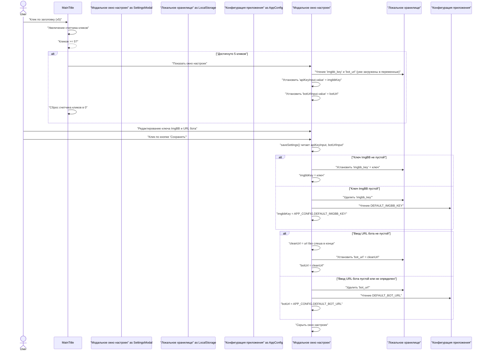
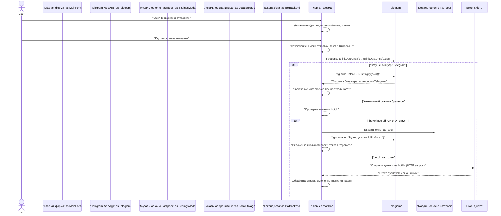
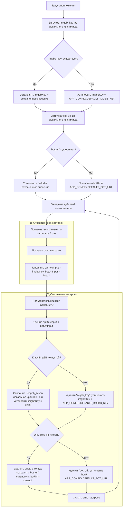

# Modern Bot

Это улучшенная и переработанная версия бота для создания заключений, включающая режим веб-приложения (Mini App).

## Возможности
- **Модульная структура**: Чистый код, организованный в папке `modern_bot/`.
- **Веб-приложение**: Удобный ввод данных через Telegram Mini App с защитой от ошибок.
- **Автономный режим**: Возможность использовать веб-приложение в любом браузере (Chrome, Safari) для генерации документов без Telegram.
- **Монетизация**: Команда `/broadcast` для рассылки сообщений всем пользователям.
- **Улучшенные отчеты**: Усовершенствованная работа с архивами и статистикой.

## Как запустить
1.  Убедитесь, что вы находитесь в корне проекта (`/Users/oleg/Project_SKLAD`).
2.  Запустите бота:
    ```bash
    python3 run_modern_bot.py
    ```
3.  **Для автономного режима**: Запустите туннель ngrok:
    ```bash
    ./start_tunnel.sh
    ```
    *Примечание: URL по умолчанию в `index.html` настроен на конкретный адрес ngrok. Если ваш URL туннеля изменится, вам нужно будет обновить его в настройках веб-приложения.*

## Настройка веб-приложения
Чтобы использовать веб-приложение:
1.  Актуальная версия мини-приложения лежит в корне репозитория (`web_app/index.html`). Копия в `modern_bot/web_app/` синхронизируется автоматически и используется как запасная.
2.  Разместите файл `web_app/index.html` на публичном сервере (например, GitHub Pages).
3.  **Автономный доступ**: Откройте URL GitHub Pages прямо в браузере.
    - Если "URL бота" не настроен или неверен, приложение предложит вам ввести его (например, ваш URL ngrok).
    - **Секретные настройки**: Нажмите на заголовок "Новое заключение" 5 раз подряд, чтобы открыть настройки вручную.

## Команды администратора
- `/add_admin <ID>`
- `/broadcast <Сообщение>`
- `/download_month <ММ.ГГГГ>`
- `/stats`

## Архитектура и потоки данных

### Поток настроек и конфигурации


### Поток отправки данных


### Логика инициализации

